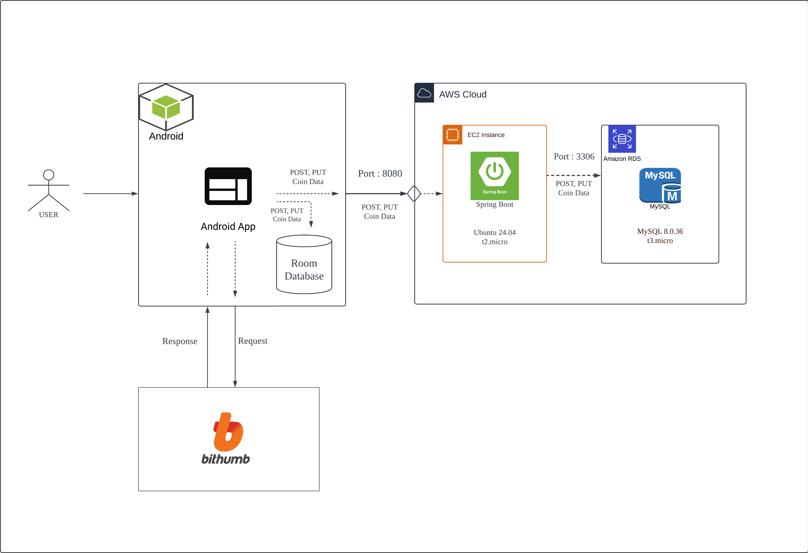
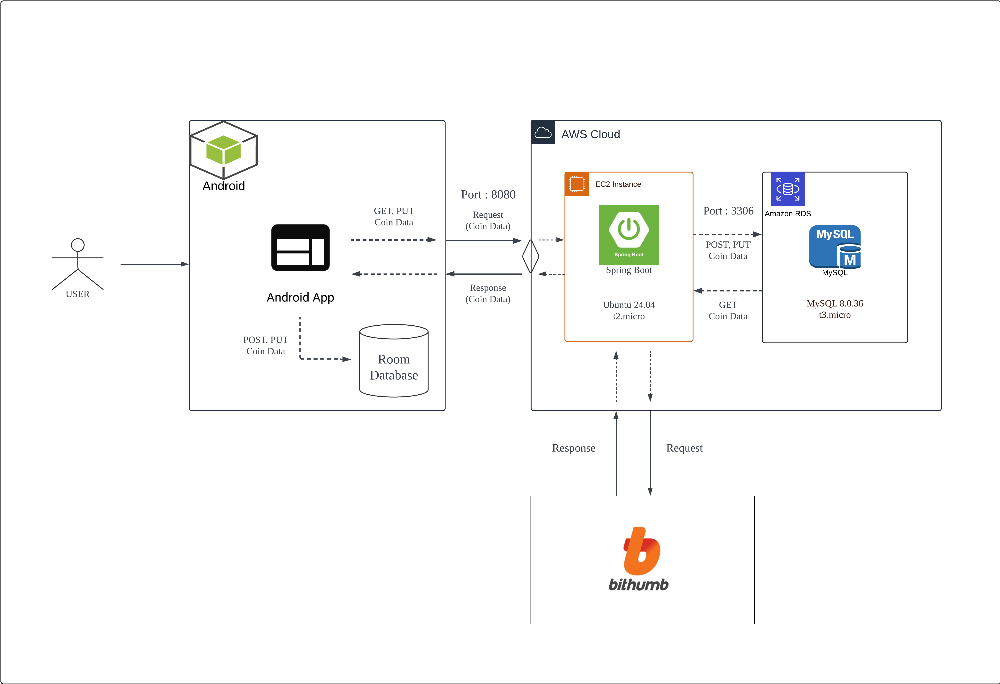

# COCO (coinApp-kotlin-springboot)
coco - Kotlin&amp;SpringBoot ver

## 1. 프로젝트 개요
COCO는 Android(Kotlin)와 Spring Boot를 사용하여 개발된 암호화폐 관리 애플리케이션입니다. 사용자가 관심 있는 코인의 가격 변동을 실시간으로 확인할 수 있도록 합니다.

> **(1) Initial Architecture Refactoring** : 2024.4.12 ~ 2024.4.23

> **(2) Advanced Architecture Refactoring** : 2024.8.1 ~ 2024.8.26


## 2. 주요 기능
- 코인 가격 실시간 확인 : 사용자가 관심 있는 코인의 실시간 가격 변동을 확인할 수 있습니다.
- 관심있는 코인 관리 : 좋아요 버튼을 통해 관심있는 코인을 저장 및 관리할 수 있습니다.
- 백엔드 관리: Spring Boot와 MySQL를 사용한 백엔드 서버를 구축하고 AWS 클라우드에 배포하여 코인 데이터를 관리합니다.


## 3. Project Architecture
> **(1) Initial Architecture Refactoring** : 2024.4.12 ~ 2024.4.23




> **(2) Advanced Architecture Refactoring** : 2024.8.1 ~ 2024.8.26




## 4. Tech Stacks

> **(1) Android Studio IDE**  
- Giraffe | 2022.3.1
    - 설치 URL : https://developer.android.com/studio?hl=ko

- VM: OpenJDK 64-Bit Server

> **(2) Android Language & Database**
- Kotlin version : 1.9.0
- RoomDB version : 2.4.1

> **(3) AVD(Android Virtual Device)**
- AVD displayname : Pixel_3a_API_34_extension_level_7_x86_64
- AVD Encoding : UTF-8
- API level : 34

> **(4) Spring Boot IDE**
- IntelliJ | 3.2.2
    - 설치 URL : https://www.jetbrains.com/ko-kr/idea/

> **(5) Spring Boot Language & Database**
- JAVA version : 17.0.10
- OpenJDK 64-Bit
- MySQL version : 8.0.36

> **(6) AWS**
- EC2 Instance : t2.micro (Ubuntu 24.04)
- RDS Instance : t3.micro (MySQL 8.0.36)


## 5. Project Structure

**Android**
```bash
src
├── App.kt   // Android App 메인 클래스
├── background   // 백그라운드 작업 처리 
│   ├── GetCoinPriceRecentContractedWorkManager.kt  // 최근 거래된 코인 가격 내역을 가져오는 WorkManager
├── dataModel  // 데이터 모델 클래스 (데이터 구조 정의)
├── dataStore  // 사용자가 앱에 처음 접속했는지 여부를 관리
├── db
│   ├── dao   // 데이터 접근 객체(DAO) 인터페이스
│   └── entity   // 데이터베이스 Entity 클래스 (RoomDB 테이블과 매핑)
├── network
│   └── model  // API 호출과 응답에 사용되는 데이터 모델
├── receiver     // 기기 부팅시, 백그라운드에서 코인 가격 정보를 업데이트
├── repository   // 데이터 처리 로직을 관리하는 repository
├── service   // 코인 가격 정보를 가져와서 알림으로 표시
└── view
    ├── adapter   // RecyclerView에서 사용되는 어댑터 클래스
    ├── intro    // 인트로 화면 관련 UI 및 로직
    ├── main    // 메인 화면 관련 UI 및 로직
    └── setting  // notification 알림창 설정

res   
├── drawble // app 화면 구성에 필요한 UI 이미지
└── layout  // app 화면 레이아웃 리소스 파일 (XML 형식)
```


**Spring Boot**
```bash
src
├── CocoSpringApplication.java     // Spring Boot 애플리케이션 메인 클래스
├── config
│   └── WebClientConfig.java   // WebClient 설정 파일
├── controller
│   └── InterestCoinController.java   // 관심있는 코인 데이터를 관리하는 API 엔드포인트
│   └── SelectedCoinPriceController.java  // 선택된 코인의 가격 데이터를 관리하는 API 엔드포인트
├── dto
│   └── InterestCoinDto.java  // 관심있는 코인 데이터 전송을 위한 DTO
│   └── SelectedCoinPriceDto.java  // 선택된 코인 가격 데이터 전송을 위한 DTO
├── entity
│   └── InterestCoinEntity.java  // 관심있는 코인 데이터 DB 테이블 매핑
│   └── SelectedCoinPriceEntity.java // 선택된 코인 가격 데이터 DB 데이터 매핑
├── repository
│   └── CoinInfoRepository.java    // 관심있는 코인 데이터 관리하는 repository
│   └── SelectedCoinPriceRepository.java  // 선택된 코인 가격 데이터를 관리하는 repository
├── scheduler
│   └── SelectedCoinScheduler.java  // 주기적으로 선택된 코인 가격을 업데이트하는 스케줄러
├── service
│   └── CoinInfoService.java   // 관심있는 코인 데이터 관련 비즈니스 로직 처리
│   └── SelectedCoinPriceService.java  // 선택된 코인 가격 데이터 관련 비즈니스 로직 처리
└── Util
    └── DateUtil.java  // 날짜 및 시간 관련 유틸리티 기능 제공
```


## 3. Components
> **3-(1) Intro**
- Splash 화면 구성
  - IntroActivity.kt / IntroViewModel.kt
  - activity_Intro.xml
- 인트로 화면 구성
  - IntroFragment1.kt / IntroFragment2.kt
  - fragment_Intro1.xml / fragment_Intro2.xml


## 4. Workflow


